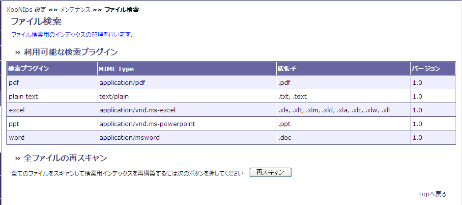

### 2.6. ファイル検索 {#2-6}

ファイル検索用のインデックスの確認ができます

*   検索プラグイン

    インストールされて利用可能なファイル検索プラグインの一覧を表示します。

*   全ファイルの再スキャン

    プラグインのバージョンが上がった際には再スキャンボタンを押すと、ファイル検索用インデックスの再構築をします。

**Figure 4.28. ファイル検索**