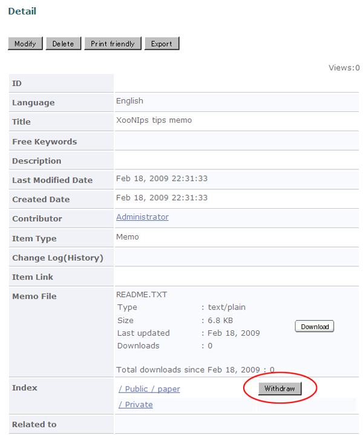

### 3.3. 共有アイテムの取り下げ {#3-3}

グループIndexへ登録済みのアイテムを共有領域から取り下げることが出来ます。

グループIndex Treeや検索を利用して取り下げたいアイテムの詳細画面を表示します。

Indexの項目の「Withdraw」ボタンを押すと、確認のダイアログが表示されますので「OK」を押してアイテムの共有を取り下げます。

**Figure 5.64. グループ共有アイテムの取り下げ**