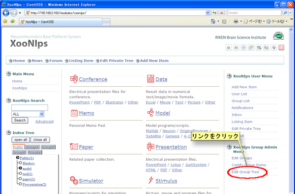
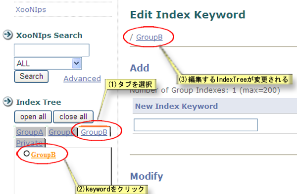

### 3.4. グループIndexの編集 {#3-4-index}

Privateと同様の手順でグループIndexのKeywordも追加・削除など編集を行うことが出来ます。

XooNIps グループメニューのグループツリー編集をクリックします。

**Figure 5.65. グループIndexの編集**

複数のグループ管理者の権限を持っている場合は、複数のグループIndexKeywordの編集が出来ます。

1.  編集したいグループIndexのタブをクリックします。

2.  編集したいグループIndexのKeywordをクリックします。

3.  クリックしたグループIndexの編集が可能になります。

**Figure 5.66. グループIndexの編集2**