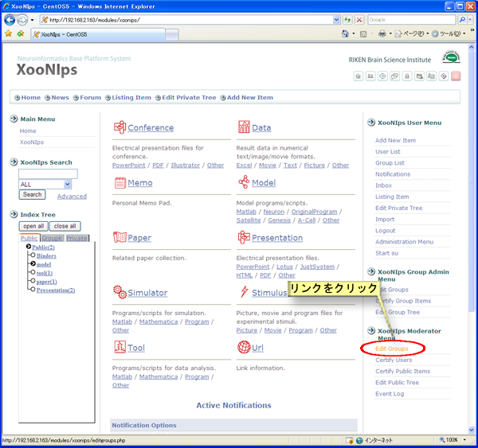
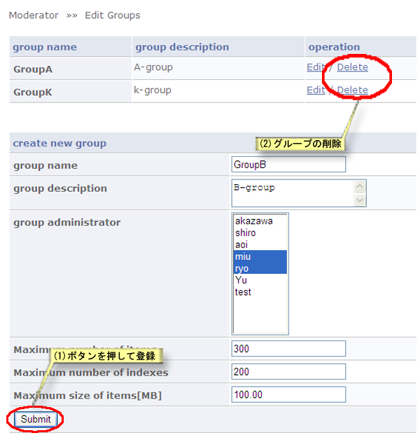

### 4.5. グループの作成と削除 {#4-5}

グループの作成と削除が出来ます。

XooNIps モデレータメニューのグループ編集のリンクをクリックします。

**Figure 5.76. グループの作成・削除**

#### 4.5.1. 新規グループの作成・削除 {#4-5-1}

1.  新規グループは、グループ作成の各項目に必要事項を入力して「送信」ボタンを押すことで作成できます。

2.  グループの削除は削除のリンクをクリックすると、確認のダイアログが表示されますので「OK」を選択して削除します。

*   グループ名

    グループの名前を入力します。

*   グループ詳細

    グループの説明文を入力します。

*   グループ管理者

    グループ管理者を選択します。複数人選択することも可能です。

*   登録可能なアイテムの最大個数

    グループ領域へのアイテム登録数上限値を入力します。

*   登録可能なインデックスの最大個数

    グループIndexのKeyword数の上限値を入力します。

*   登録可能なアイテムの最大ディスク容量[MB]

    グループ領域で使用するデータ領域の最大値をMB単位で入力します。

**Figure 5.77. グループの作成・削除**

#### 4.5.2. グループ情報の編集 {#4-5-2}

情報を編集したいグループの右にある編集リンクをクリックします。

項目を修正した後、「送信」ボタンを押して情報を反映させます。