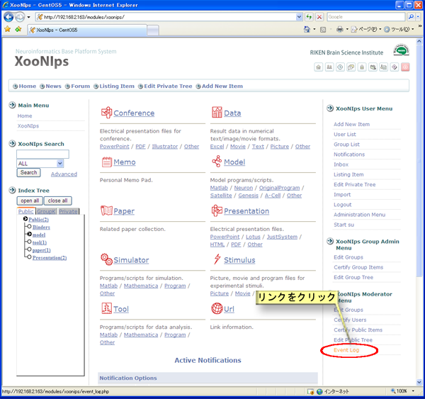
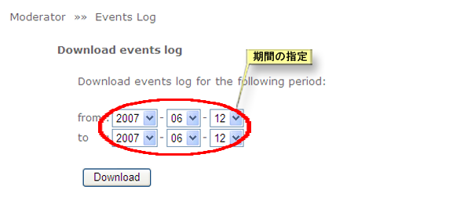
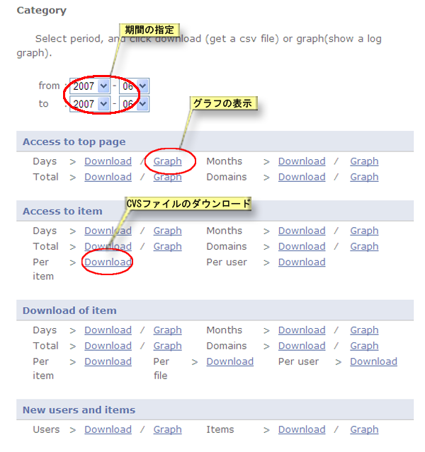
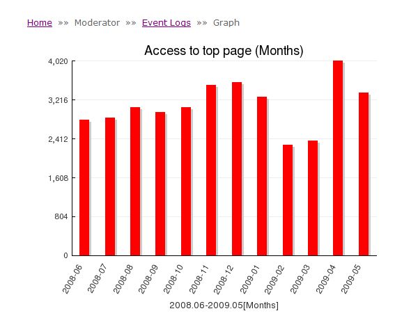

### 4.6. アクセスログ解析 {#4-6}

XooNIpsが取得しているイベントログをCSV形式ファイルでダウンロードしたり、グラフ化することが出来ます。

XooNIps モデレータメニューのイベントログのリンクをクリックします。

**Figure 5.78. イベントログ解析**

*   イベントログダウンロード

    イベントログのダウンロード

    期間を指定してXooNIpsのイベントログをCSV形式ファイルでダウンロード出来ます。

    

    **Figure 5.79. イベントログの期間指定ダウンロード**

*   イベント別

    トップページのアクセス、アイテムへのアクセス、アイテムのダウンロード、新規ユーザーの登録とアイテム登録について期間を指定してCSV形式ファイルでダウンロードするかグラフ化して表示することが出来ます。

    

    **Figure 5.80. イベントログ及びユーザ・アイテム一覧の個別ダウンロードとグラフ表示**

    

    **Figure 5.81. イベントログのグラフ表示**

*   登録状況確認

    ユーザー及びアイテム一覧を見ることが出来ます。