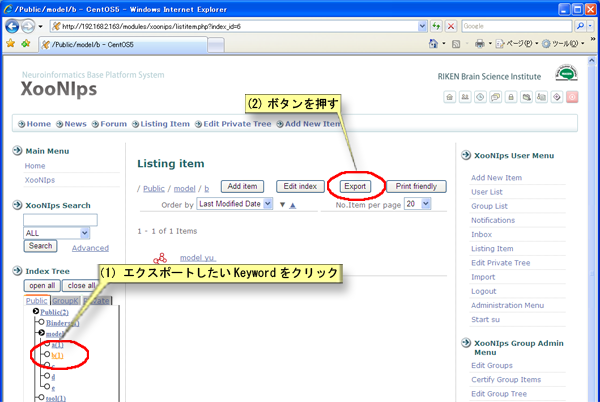
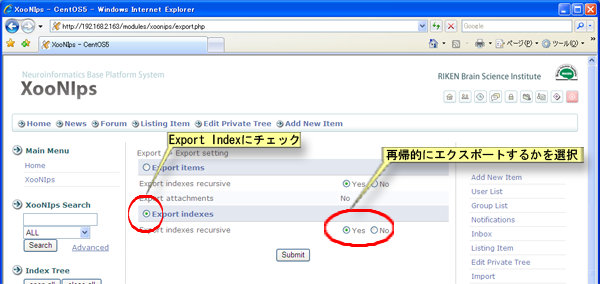
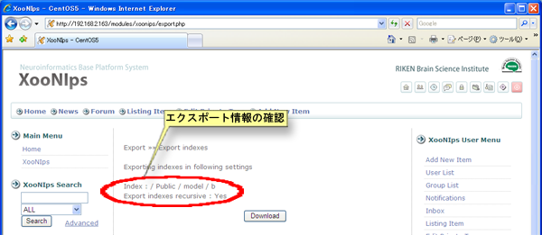
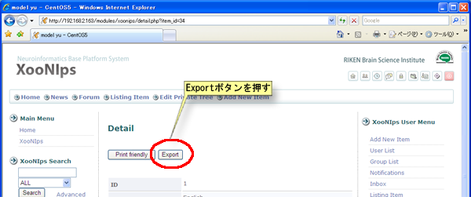

### Tip {#tip}

アイテムが登録されていない空のIndex Keywordはエクスポート出来ません。

Index Keywordをクリックしてアイテム一覧画面を表示します。

エクスポートしたいKeywordをクリックして、「Export」ボタンを押します。

**Figure 5.85. Indexのエクスポート**

インデックスツリーをエクスポートするにチェックを入れます。再帰的にエクスポートする場合にはインデックスを再帰的にエクスポートするの項目をはいに設定してください。

**Figure 5.86. Indexのエクスポート2**

エクスポートされる情報が表示されますので、確認した上で「ダウンロード」ボタンを押すとエクスポートファイルがダウンロードされます。

**Figure 5.87. Indexのエクスポート3**

*   アイテムのエクスポート

    検索などを利用してエクスポートしたいアイテムの詳細画面を表示して、「エクスポート」ボタンを押します。

    

    **Figure 5.88. アイテムのエクスポート**

    添付ファイルを同時にエクスポートするかどうかの設定をします。