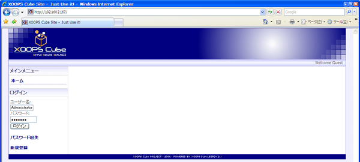
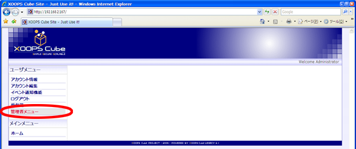
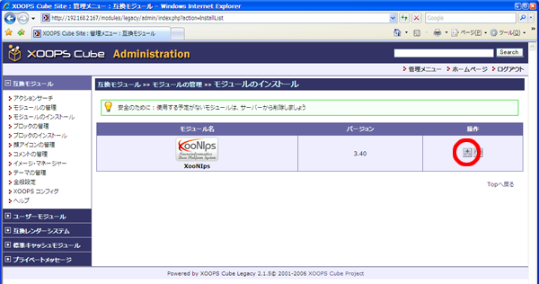
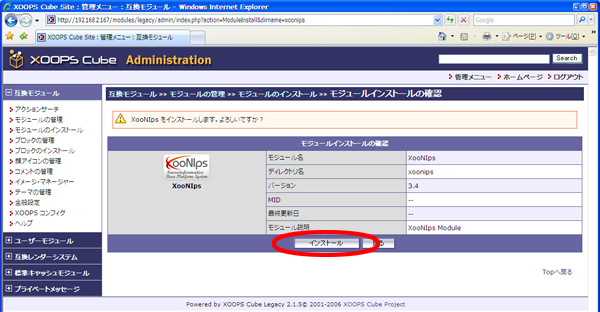
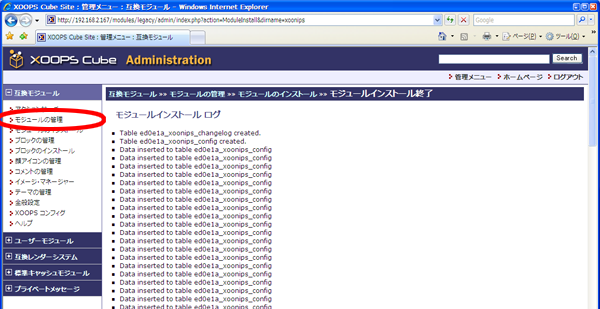
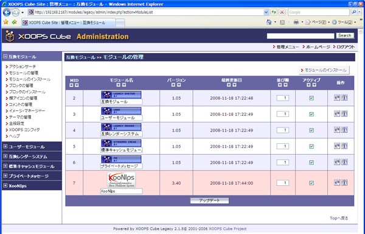

### 6.1. XooNIpsセットアップ {#6-1-xoonips}

Webブラウザでhttp://サーバ名/へアクセスをします。

情報を入力してログインボタンをクリックします。

| ユーザ名 | 管理者ユーザ名(例はAdministrator) |
| --- | --- |
| パスワード | 管理者パスワード |

[管理者メニュー]をクリックします。

[モジュールのインストール]をクリックします。

操作欄にあるインストールアイコンをクリックします。

インストールボタンをクリックします。

[モジュールの管理]をクリックします。

XooNIpsのインストールが正常に行われていればこの様な画面になります。